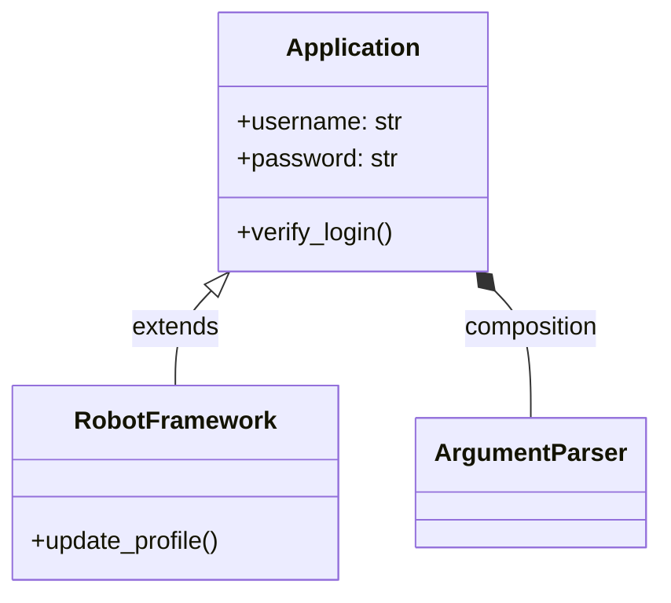

# Robot Framework

<TagLinks />

## Console Script

```mermaid
classDiagram
  Application <|-- RobotFramework : extends
  Application *-- ArgumentParser : composition

  class Application{
    +username: str
    +password: str
    +verify_login()
  }
  class RobotFramework{
      +update_profile()
  }
  class ArgumentParser{
  }
link Application "http://www.github.com" "This is a tooltip for Application"
```

<Footer />
