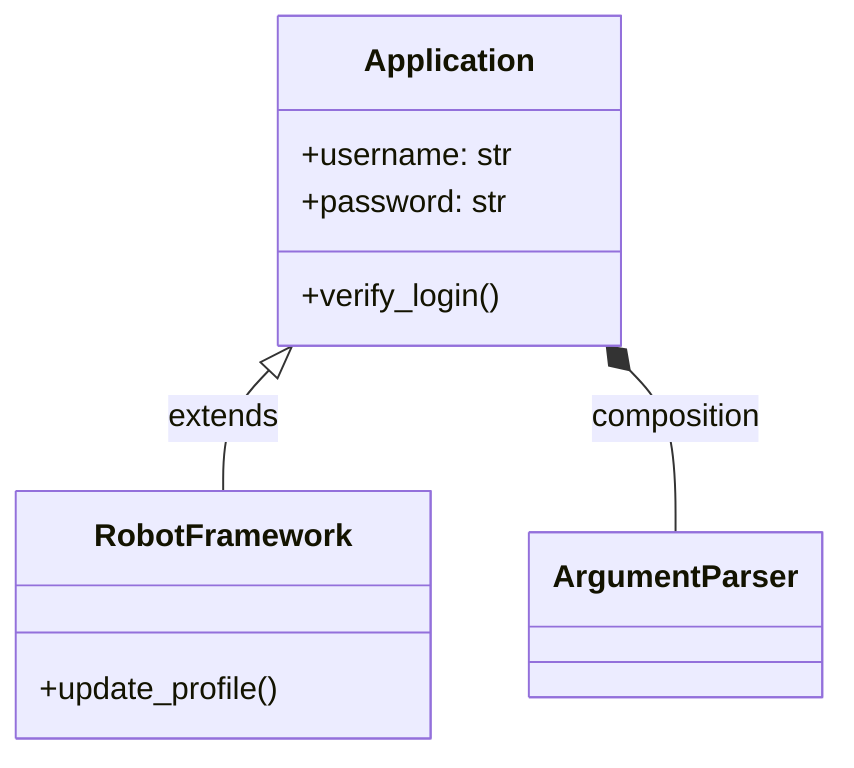
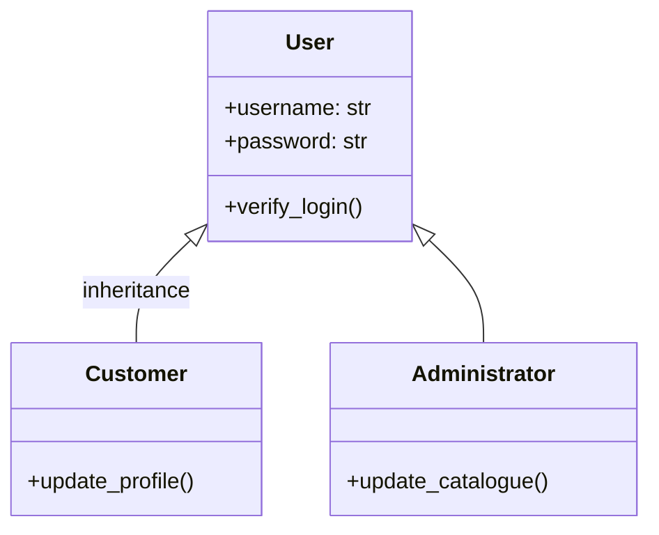

# Robot Framework

<TagLinks />

## Console Script

## :chart: UML Diagram

[UML](https://en.wikipedia.org/wiki/Unified_Modeling_Language) - Unified Modelling Language
:   structure of a software system

    * [Class Diagrams](https://en.wikipedia.org/wiki/Class_diagram)

<Footer />
