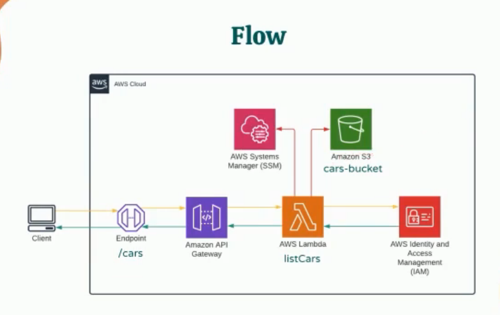
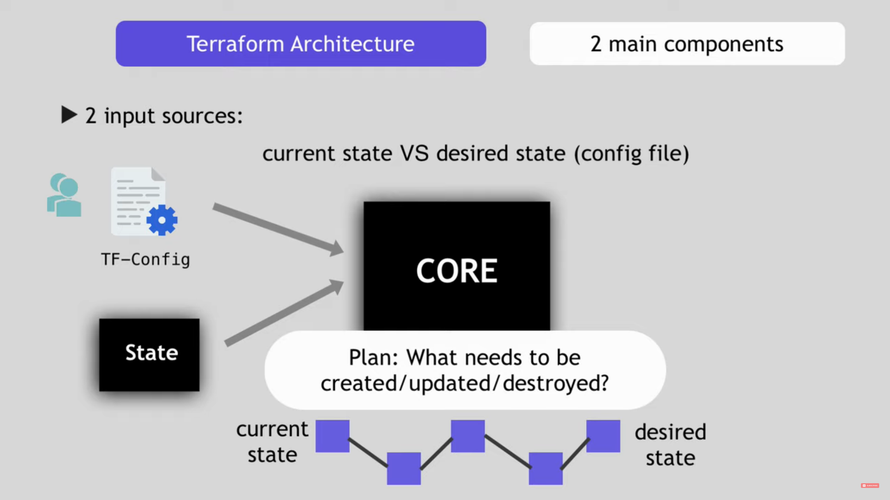

# Serverless Django REST APIs

<TagLinks />

## What is Serverless?

Pay not for the time, BUT for number of API invokations

::: tip diff b/w amazon API gateway and Lambda Function
API Gateway provides tools for creating and documenting web APIs that route
HTTP requests to Lambda functions.

Explicitly define **Methods** and **Resources**
:::

Can write AWS Lambda functions in Python and then map them to API gateway resources with methods

## How to create and deploy lambda functions to cloud services?

- Terraform - (core, state, config), (refresh, plan, apply, destroy)
- Serverless
- Cloud Formation

Automate and manage Infrastructure on multiple cloud services decleratively.

- Replicating environments (development, canaray, staging, production)

What the difference b/w ansible and terrraform?

- Infrastructure as a code
- Ansible is mainly Configuration Tool

## AWS Lambda Function

- Do you want to pass the headers from API Gateway to lambda functions?
- How to link lambda function with API gateway?
- Public or private APIs?
- IAM to give lambda function permission to access S3 bucket (using as database)
- Can I test AWS lambda functions locally?
- **ARN** is provided in **IAM** to restrict/allow the resource access
- **Amazon Systems Manager** to store secrets
- How to secure API Endpoint? Public to restricted => use AWS Cognito
- How to bundle external python librarires in lambda like requests? Zip them together and then upload

## Questions

- Can I write a django in lambda?

<iframe width="560" height="315" src="https://www.youtube.com/embed/AcbxnqZ2l9I" title="YouTube video player" frameborder="0" allow="accelerometer; autoplay; clipboard-write; encrypted-media; gyroscope; picture-in-picture" allowfullscreen></iframe>

<iframe width="560" height="315" src="https://www.youtube.com/embed/Ul6FW4UANGc" title="YouTube video player" frameborder="0" allow="accelerometer; autoplay; clipboard-write; encrypted-media; gyroscope; picture-in-picture" allowfullscreen></iframe>

<Footer />
