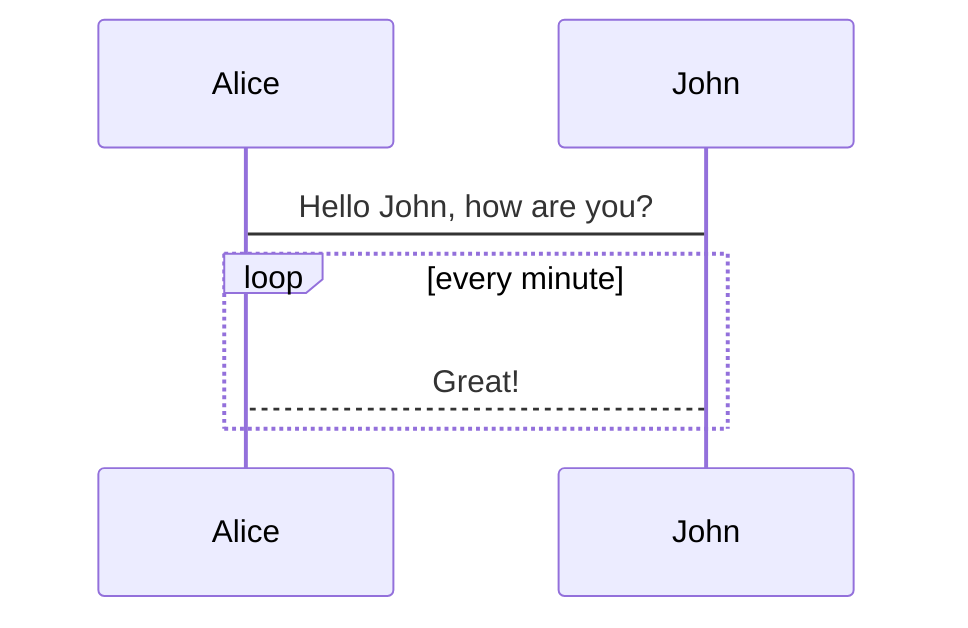
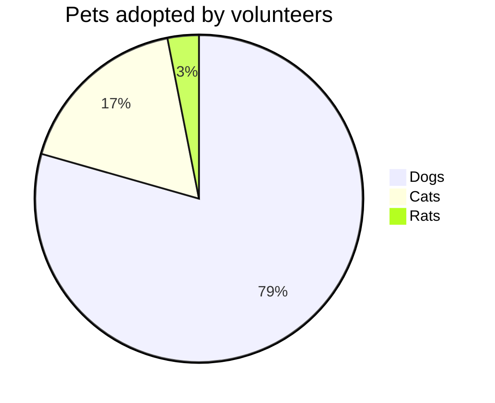

# Hello VuePress

## Mermaid





<<< @/../hidden_features.py#snippet{5}

### sub
H~2~0

### Sup
29^th^

## Footnote

Here is a footnote reference,[^1] and another.[^longnote]

[^1]: Here is the footnote.

[^longnote]: Here's one with multiple blocks.

## Definition List

Term 1

:   Definition 1

Term 2 with *inline markup*

:   Definition 2

        { some code, part of Definition 2 }

    Third paragraph of definition 2.

## Abbr

*[HTML]: Hyper Text Markup Language
*[W3C]:  World Wide Web Consortium
The HTML specification
is maintained by the W3C.

## Emoji

:smile: :tada: :100:


## Container

::: warning
*here be dragons*
:::

## markdown-it-ins

++inserted++

## markdown-it-mark

==marked==


### Add all markdown packages

```
yarn add -D markdown-it-container markdown-it-footnote markdown-it-deflist markdown-it-emoji markdown-it-mark markdown-it-abbr markdown-it-sub markdown-it-sup markdown-it-ins
```
