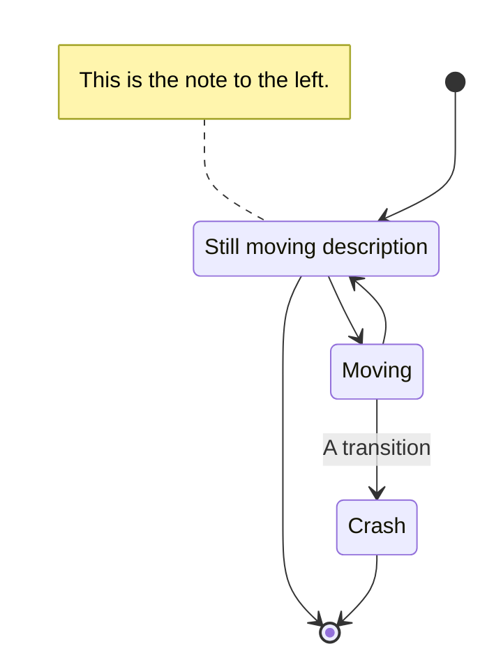

# :snake: Python study material

<TagLinks />

## :office: Official resources

* https://www.python.org/about/gettingstarted/
* https://docs.python.org/3/tutorial/index.html

## :family: Others

* https://gist.github.com/sloria/7001839
* https://github.com/willmcgugan/rich
* https://www.priceintelligently.com/
* https://www.google.com/search?q=SaaS&newwindow=1&hl=en&source=lnms&tbm=isch&sa=X&ved=2ahUKEwjciOvMtdrpAhUcZxUIHXqyBmIQ_AUoAXoECDoQAw&biw=1294&bih=641#imgrc=Qwze79n_6S-sMM

## :woman_office_worker: Interview Prep

* https://github.com/MaximAbramchuck/awesome-interview-questions

