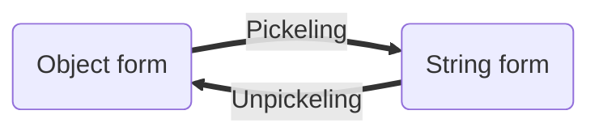
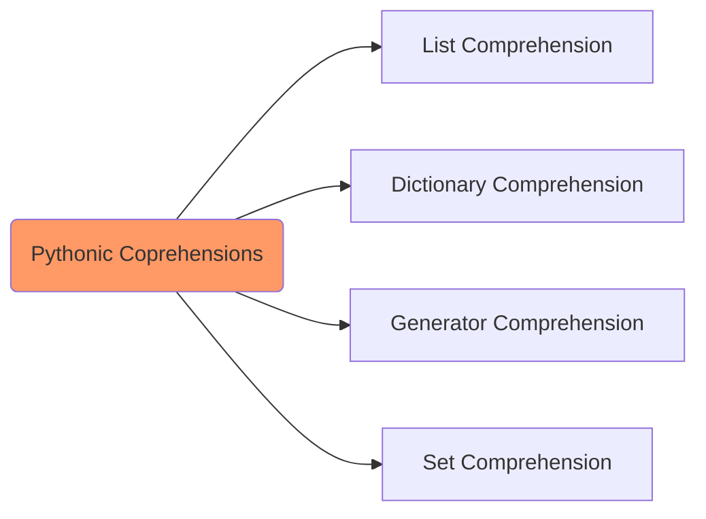

# :prayer_beads: Strings

<TagLinks />

> batteries included” philosophy

* zen of python

## :shield: General

* immutable basic types (numbers, strings, tuples)
* mutable objects such as lists, dictionaries, and most other types)
* python [REPL](https://en.wikipedia.org/wiki/Read%E2%80%93eval%E2%80%93print_loop)
* callable means which can be called using `__call__()` special method
* [Mixin](https://en.wikipedia.org/wiki/Mixin)
  * **included** rather than being **inherited**
  * vue mixins
* **Dunder**/Magic/Special methods in Python
  * double underscore methods
* [How are dict implemented in python?](http://effbot.org/pyfaq/how-are-dictionaries-implemented.htm)
* Arguments vs Parameters
  * [call by assignment](https://docs.python.org/3/faq/programming.html#how-do-i-write-a-function-with-output-parameters-call-by-reference)
  * call by references, howto in python?
  * call by value

Pickeling/Unpickeling
: Pickling is converting an object to a string representation in python. Generally used for caching and transferring objects between hosts/processes. Python Objects => Strings

Lambda Function
: Lambda in Python is an anonymous function created at runtime. E.g.

::: tip Parameters
Although, there is no formal rule on calling them `*args/**kwargs`,
people tend to name them that way. When a function is declared `def my_func(*args, **kwargs)`,
args is a **tuple** with all positional arguments passed to the function and kwargs is a
with all keyword arguments. They can be named anything as long as the **unpack** operators `*` and `**` are used.
So `*` unpacks a tuple and `**` unpacks a dict.
:::

**Introspection** is the ability to examine an object at runtime. Python has a `dir()` function that supports examining the attributes of an object, `type()` to check the object type, `isinstance()`, etc.
While introspection is passive examination of the objects, **reflection** is a more powerful tool where we could modify objects at runtime and access them dynamically. E.g.
`setattr()` adds or modifies an object's attribute;
`getattr()` gets the value of an attribute of an object.
It can even invoke functions dynamically - getattr(my_obj, "my_func_name")()

## :flags: DataTypes

* dictionaries
  * It stores key-value pairs, where keys are unique and it has **O(1)** access time.
  * The most important limitation for a dict is that the keys must be hashable/immutable. Meaning, we can use a tuple as a key, but not a list.

## String Formatting

1. using C-style string formatting using `%`, old-style
2. using Python `.format()`, new-style

## String Manipulation

Since strings are stored as an array of type `char` in memory, these could be manupulated using **list comprehensions**

List comprehensions
: which creates a new list based on another list, in a single, readable line.

### Types of comprehensions in Python

Comprehensions in Python provide us with a short and concise way to construct new sequences (such as lists, set, dictionary etc.)

## Manupulation Techniques

* Type checking using `is` or `instance` keyword
* pickeling and [serialization]/Jsonify of string types. Sometimes also known as **marshalling** and unmarshalling

## :building_construction: Classes

* old-style Classes
* new-style classes
* https://realpython.com/python-metaclasses/

::: tip Aliasing
Objects have individuality, and multiple names (in multiple scopes) can be bound
to the same object. This is known as aliasing in other languages.
:::

## :department_store: Scopes and Namespaces

Namespace created by interpreter
: is a mapping from names to objects. Most namespaces are currently implemented as Python dictionaries, but that’s normally not noticeable in any way (except for performance), and it may change in the future. It is like a box where a variable name is mapped to the object placed. Whenever the variable is searched out, this box will be searched, to get corresponding object.

* global namespace at startup
* local namespace when function is called, deleted, exception, modified etc.

Scope
: is a textual region of a Python program where a namespace is directly accessible. “Directly accessible”

* When a class definition is entered, a new namespace is created, and used as the local scope — thus, all assignments to local variables go into this new namespace. In particular, function definitions bind the name of the new function here.
* Class objects support two kinds of operations
  * Attribute references and
  * Instantiation
* class Attributes
  * shared between all instances
  * local instances Attributes
* class Methods
  * python functions bounded to classname
* Python support **Multiple Inheritance**
  * MRO - Method Resolution Order
  * [Diamond Relationship Problem](https://en.wikipedia.org/wiki/Multiple_inheritance#The_diamond_problem)
* “Private” instance variables that cannot be accessed except from inside an object don’t exist in Python.

## :question: General Questions

* Modules and Packages
  * modules for BI and module for GUI combined together to form a Packages

## :paperclip: References

* https://pyformat.info/

[serialization]: https://en.wikipedia.org/wiki/Serialization

