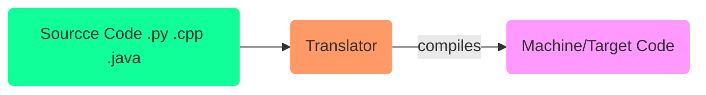
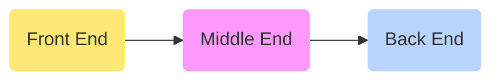
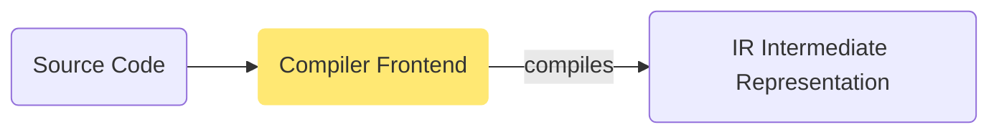
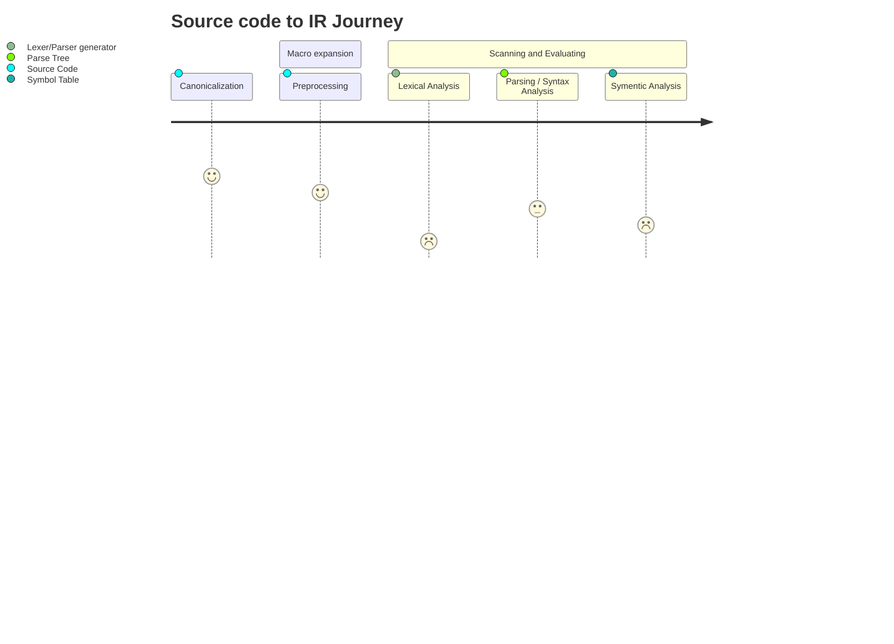
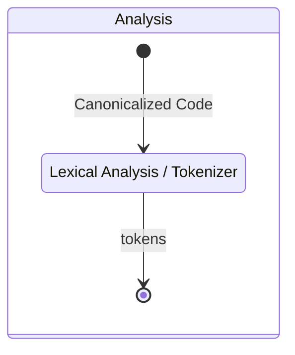
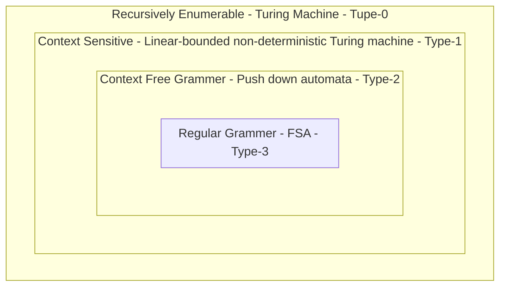
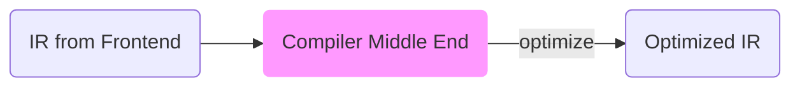
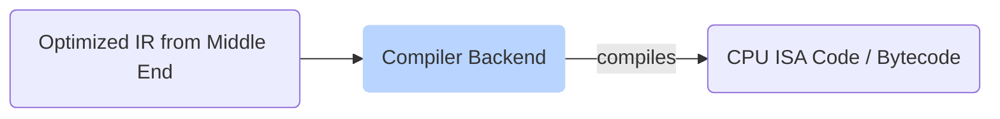
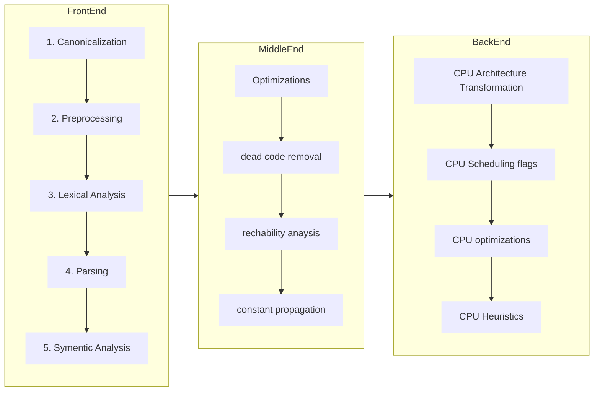
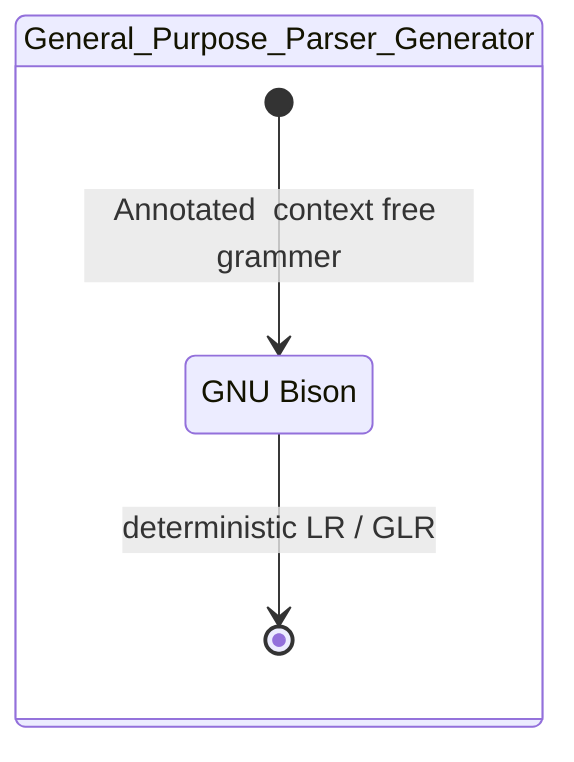

# :hammer_and_wrench: Compiler

<TagLinks />

> How to write your own programming language?

* Examples
  * GNU Compiler Collection - [GCC](https://en.wikipedia.org/wiki/GNU_Compiler_Collection)
  * LLVM
  * Clang
  * javascript Compilers - V8 Engine
  * CPython - python compiler/interpreter
* [Guido van Rossum] - Benevolent dictator for life BDFL for Python until 2018



* Programming is mainly writing correct code for compilers. If you can program in a language means you know how to write instructions for a specific compiler.
* Programming languages differ widely because their compilers are written so.

## :palm_tree: Types of Compilers

Cross-Compiler
:   compiles code for a target platform(CPU architecture)

    ```mermaid
    graph LR
    A(Host architecture x86):::blue
    B(Target architecure ARM):::yellow
    A -- CrossCompilation --> B
    classDef blue fill:#b8d4ff,stroke-width:0px;
    classDef yellow fill:#FFE873,stroke-width:0px;
    ```
    1. compiler for different CPU Architecture
    2. on x86 compiling code for ARM Architecture


Assembler
:   Translate code to assembly languages

Transpiler - S2S compiler
:   compiles code from one version to another. Eg: ==Babel== in JS world

    **Eg:** From modern ES2015 to ES5 to support older browsers

    ```mermaid
    graph LR
    A(modern ES-2015):::green
    B(old ES-5):::blue
    A -- Transpile --> B
    classDef green fill:#1f9,stroke-width:0px;
    classDef blue fill:#b8d4ff,stroke-width:0px;
    ```

Decompiler
:   compiles from a Low Level Language to High Level Language

    ```mermaid
    graph LR
    A(Low level Language):::yellow
    B(High Level Language):::orange
    A -- Decompiler --> B
    classDef orange fill:#f96,stroke-width:0px;
    classDef yellow fill:#FFE873,stroke-width:0px;
    ```

Bytecode Compiler
:   JAV, Python VM


JIT - Just in time Compilers

[Bootstrapped Compilers](https://en.wikipedia.org/wiki/Bootstrapping_(compilers))
:   Self Compiled - compiled by itself


## :paintbrush: Compiler Design

* Translates code from one form to another



## :art: Compiler Frontend

Generally a **5 Stages Process** Line. Just how a Buddha rice bown is assembles in a restaurant.





### :racing_car: Canonicalization

1. converting to a format more suitable to work with
2. remove extra spaces etc.

Very similar to Database System Canonicalization of data to **1NF**, **2NF** or **3NF**

### Preprocessing

1. Macro Substitution
2. Conditional Compilation

### :grapes: Lexical Analysis / Tokenization

> very important Stage and most complex when implementing any programming language

1. source code is converted to token, so that a hierarical tree could be generated
2. Can happen in 2 Stages
   1. **Scanning**
      1. convert code blocks to **leximes**
         1. keywords
         2. literals
         3. identifiers
         4. references
         5. comments
         6. seperators
         7. operators
   2. **Evaluating**
      1. Attackes leximes with values so that they could be used in Parsing stage
      2. Token Name: Token Value Format

::: tip Scanning
Scanning is performed using
* **RegEx**
* **CFG** Context-free Grammer
* RegEx Languages and
* **FSM** Finite State Automata Schemes
:::

* [BNF](https://en.wikipedia.org/wiki/Backus%E2%80%93Naur_form), [EBNF](https://en.wikipedia.org/wiki/Extended_Backus%E2%80%93Naur_form)
  * Intended for consumption by humans
  * [BNF Python](https://docs.python.org/3/reference/introduction.html#notation)
* [Python Lexical Analysis](https://docs.python.org/3/reference/lexical_analysis.html)
* [Full Python Grammer](https://docs.python.org/3/reference/grammar.html)
* [Difference b/w regular grammer and Context free grammer](https://stackoverflow.com/questions/559763/regular-vs-context-free-grammars)
* [How to write grammer for a programming language](https://en.wikipedia.org/wiki/Extended_Backus%E2%80%93Naur_form)
* [Chomsky hierarchy of grammer](https://en.wikipedia.org/wiki/Chomsky_hierarchy)
* [Allison Parrish](https://www.decontextualize.com/)
* [Grammer Parsing Engines](https://en.wikipedia.org/wiki/Comparison_of_parser_generators)
  * [Tracery for JS](https://github.com/galaxykate/tracery/tree/tracery2)



[Grammer](http://matt.might.net/articles/grammars-bnf-ebnf/)
:   Language of languages, [Chomsky Hierarchy](https://en.wikipedia.org/wiki/Chomsky_hierarchy)

[CFG](https://en.wikipedia.org/wiki/Context-free_grammar) - Context Free Grammer
:   Every [production rules] of the form $A \rightarrow \alpha$

    where,

    $A$ is **non-terminal** and $\alpha$ is **terminal** character

    4-tuple ${\displaystyle G=( V,\Sigma ,R,S )}$

    where,

    1. ${\displaystyle v\in V}v\in V$ is called a nonterminal character or a variable
    2. $\Sigma$ is a finite set of terminals,
    3. $R$ is a finite relation from $V$ to ${\displaystyle (V\cup \Sigma )^{*}}(V\cup \Sigma )^{*}$
    4. $S$ start variable

    * [Terminal / Non-Terminal Symbols](https://en.wikipedia.org/wiki/Terminal_and_nonterminal_symbols)
    * [How to write CFG for a language?](https://youtu.be/nyjB5xW0tQc)
    * [Language for writing compilers?](https://en.wikipedia.org/wiki/Compiler_Description_Language)

[production rules]: https://en.wikipedia.org/wiki/Production_(computer_science)

[CSG](https://en.wikipedia.org/wiki/Context-sensitive_grammar) - Context Sensitive Grammar
:   more general than CFG

    A formal grammar :triangular_ruler: $G = (N, \Sigma, P, S)$

    Notation | Meaning
    :-------:|:-----------
    $N$       | is a set of nonterminal symbols
    $\sigma$  | is a set of terminal symbols
    $P$       | is a set of production rules, and
    $S$       | is the start symbol

    is context-sensitive if all rules in $P$ are of the form

    ::: tip CSG formal definition
    $\alpha A \beta \rightarrow \alpha \gamma \beta$

    where,

    1. :point_right:   $A \in N$
    2. :point_right:   $\alpha , \beta \in ( N \cup \Sigma)\ast$ and
    3. :point_right:   $\gamma \in ( N \cup \Sigma)+$
    :::


##  :de: Grammar



Formal Grammer
:   Finite set of production Rules

    Examples, write grammer to match all a, aa, aaaa, aaaaaaa

    1. $S \rightarrow S$
    2. $S \rightarrow aS$


### :evergreen_tree: Parsing / Syntax Analysis

> crucial stage in Process

Outputs **Parse Tree**

### :computer: Symentic Analysis

Outputs **Symbol Table**

1. Builds Type checking
2. Object Binding

## :desktop_computer: Compiler Middle End

1. Optimizations
2. Dead code removal
3. Constant propagation
4. Rechability Analysis



## :dragon_face: Compiler Backend

> Could be reuses as in cross Compilers

1. CPU Architecture level Transformation
2. CPU Scheduling Flags
3. CPU architecture based Optimization to utilize CPU features like
   1. Hypreadthreaded feature
   2. Multicore
   3. GPUs etc
4. CPU Heuristics and Algorithms



### :mag_right: Overview



### How compilers are used?

Compiler interface usually have a CLI interface. Works just like another CLI tool so as to speak.
Take examples of python, node, rust, java, bash, zsh compilers.

## :cow: Parser Generators

> Parser check the grammer and syntax of a natural/computer language.
> Syntatic Analysis


* [Compiler-compiler softwares](https://en.wikipedia.org/wiki/Compiler-compiler)
  * [YACC](https://en.wikipedia.org/wiki/Yacc)
  * [GNU Bison](https://en.wikipedia.org/wiki/GNU_Bison)
    * [documentation](https://www.gnu.org/software/bison/manual/html_node/index.html#SEC_Contents)
    * Generates a parser in `C`, `C++`, or `java`
    * Perl 5
    * GNU OCtave
    * MySQL, PostgresSQL
    * Bash
    * Go - initiall then shifted to their own custom tool
    * PHP, Ruby
* [ANTLR](https://www.antlr.org/)
* [CPython uses ASDL](https://stackoverflow.com/questions/10748648/what-parser-generator-does-cpython-use)



* Can generate parser from calculator to complex language
* `filename.l`
* 4 sections
* commenting is not allowed

Bison Input Grammer File structure

```
%{
Prologue
%}

Bison declarations

%%
Grammar rules
%%
Epilogue
```

## :cyclone: Resources

* https://en.wikipedia.org/wiki/Instruction_set_architecture


[compiler]: https://en.wikipedia.org/wiki/Compiler
[Guido van Rossum]: https://en.wikipedia.org/wiki/Guido_van_Rossum


<Footer />
