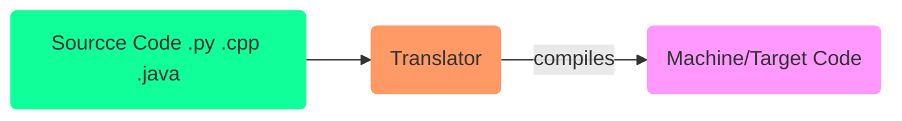
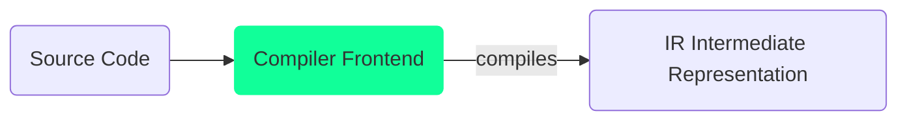
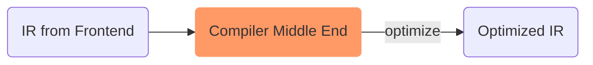
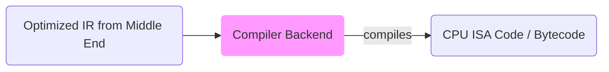
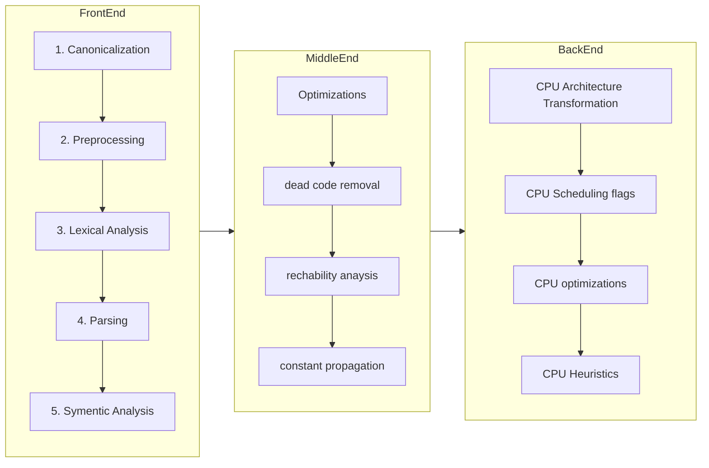

# :hammer_and_wrench: Compiler

<TagLinks />

* How to write your own programming language?
* Examples
  * GCC - GNU Compiler Collection
  * LLVM
  * Clang
  * javascript Compilers - V8 Engine
  * CPython - python compiler/interpreter
* [Guido van Rossum] - Benevolent dictator for life BDFL for Python until 2018

## :palm_tree: Types of Compilers

1. Cross - compiler
   1. compiler for different CPU Architecture
   2. on x86 compiling code for ARM Architecture

Assembler
: Translate code to assembly languages

Transpiler - S2S compiler
: compiles code from one version to another. Eg: **Babel** in JS world

Decompiler
: compiles from a Low Level Language to High Level Language

Bytecode Compiler
: JAV, Python VM

JIT - Just in time Compilers

Self Compiled - compiled by itself

## :paintbrush: Compiler Design

* Translates code from one form to another

## :art: Compiler Frontend

Generally a **5 Stages Process** Line. Just how a Buddha rice bown is assembles in a restaurant.

### :racing_car: Canonicalization

1. converting to a format more suitable to work with
2. remove extra spaces etc.

Very similar to Database System Canonicalization of data to **1NF**, **2NF** or **3NF**

### Preprocessing

1. Macro Substitution
2. Conditional Compilation

### :grapes: Lexical Analysis / Tokenization

> very important Stage and most complex when implementing any programming language

1. source code is converted to token, so that a hierarical tree could be generated
2. Can happen in 2 Stages
   1. **Scanning**
      1. convert code blocks to **leximes**
         1. keywords
         2. literals
         3. identifiers
         4. references
         5. comments
         6. seperators
         7. operators
   2. **Evaluating**
      1. Attackes leximes with values so that they could be used in Parsing stage
      2. Token Name: Token Value Format

::: tip Scanning
Scanning is performed using
* **RegEx**
* **CFG** Context-free Grammer
* RegEx Languages and
* **FSM** Finite State Automata Schemes
:::

### :evergreen_tree: Parsing / Syntax Analysis

> crucial stage in Process

Outputs **Parse Tree**

### :computer: Symentic Analysis

Outputs **Symbol Table**

1. Builds Type checking
2. Object Binding

## :desktop_computer: Compiler Middle End

1. Optimizations
2. Dead code removal
3. Constant propagation
4. Rechability Analysis

## :dragon_face: Compiler Backend

> Could be reuses as in cross Compilers

1. CPU Architecture level Transformation
2. CPU Scheduling Flags
3. CPU architecture based Optimization to utilize CPU features like
   1. Hypreadthreaded feature
   2. Multicore
   3. GPUs etc
4. CPU Heuristics and Algorithms

### :mag_right: Overview

## :cyclone: Resources

* https://en.wikipedia.org/wiki/Instruction_set_architecture

[compiler]: https://en.wikipedia.org/wiki/Compiler
[Guido van Rossum]: https://en.wikipedia.org/wiki/Guido_van_Rossum

<Footer />
