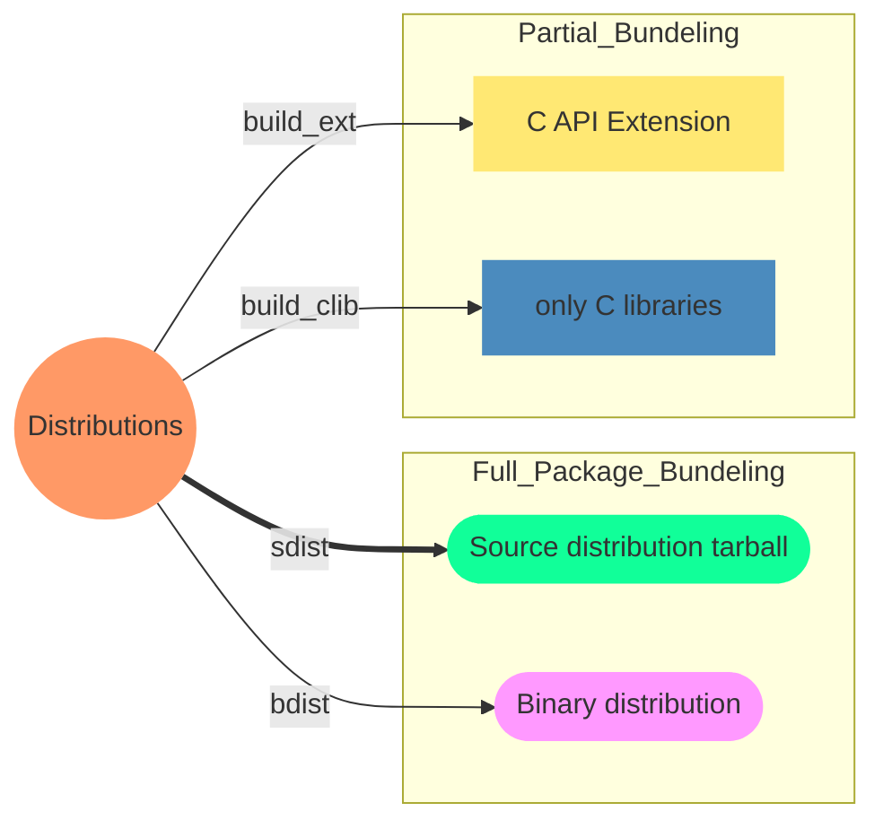

# Virtual Environment

<TagLinks />

* Run multiple python appications running on different versions on same machine
* sets up relative paths (symlinks) to new interpreter

```
venv/
|-- bin
|-- include
|-- lib
|   `-- python3.8
|       `-- site-packages
|           |-- PyPI package 1
|           |-- PyPI package 2
|           |-- PyPI package N
|-- lib64 -> lib
`-- share
    `-- python-wheels
```

Python package build command

```
python setup.py --help-commands

# link source files in sites-package
python setup.py --verbose develop

# develop
Location: .../robotframework/src
# install
Location: .../robotframework/venv/lib/python3.8/site-packages
```



setup.py keys | what does it do?
:-------------|--------------
`packages = ['foo']` | you are promising that the Distutils will find a file `foo/__init__.py`
`package_dir = {'foo': 'lib'}`   | inside `lib` you will find a `foo/__init__.py`
`package_data`  | might contain documentation files for package
`entry_points = {'console_scripts': ['robot = robot.run:run_cli']`  | run as a CLI tool


<Footer />
