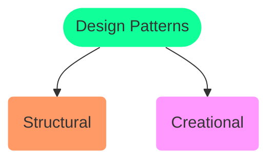
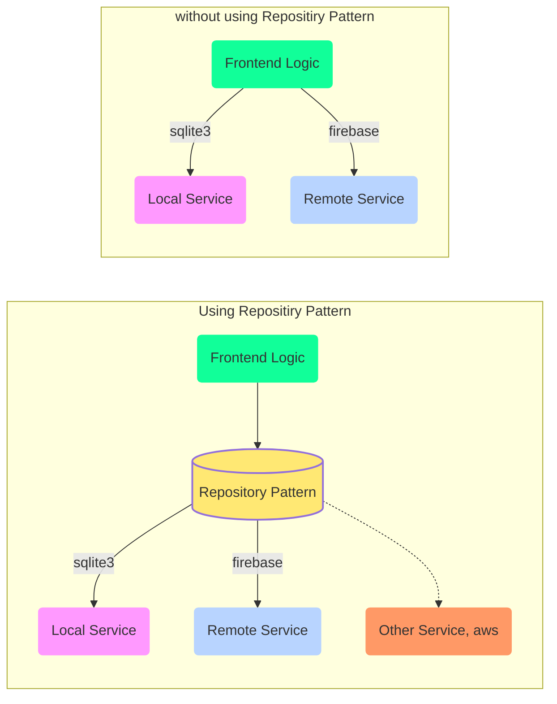

# :high_brightness: Design Patterns

<TagLinks />

[Why do we need design patterns in programming?](https://en.wikipedia.org/wiki/Software_design_pattern)

## :black_square_button: Programming Paradigm

[Programming Paradigm](https://en.wikipedia.org/wiki/Programming_paradigm)

1. Imeperative
2. Declerative
3. Object Oriented Paradigm

## :large_blue_circle: Repositiry Pattern

> Low [cohesion] b/w Frontend and Backend

We should **not** have to change frontend if we choose to ==add/remove== 1 or more
backend services.

Say we want an app (web, mobile) which works both with internet (using remote service like Firebase)
and **without** internet (local database service like sqlite3)

Useful when requirnment changes, now we need 4 databases! With Repositiry pattern it will easily scale
due to low [cohesion] b/w frotend and backend and high [coupling] at backend

[How to implement Repository Pattern in Python?](https://stackoverflow.com/questions/9699598/implementation-of-repository-pattern-in-python)

[cohesion]: https://en.wikipedia.org/wiki/Cohesion_(computer_science)
[coupling]: https://en.wikipedia.org/wiki/Coupling_(computer_programming)

## :church: Facade Pattern [wiki](https://en.wikipedia.org/wiki/Facade_pattern)

> Principle of Least Knowledge

Analogous to a facade in architecture, a facade is an object that serves as a front-facing interface masking more complex underlying or structural code.

* High [coupling] is bad when we have to change things.
* Law of demeter

## :microscope: Programming Methodologies

### [GRASP](https://en.wikipedia.org/wiki/GRASP_(object-oriented_design))

General Responsibility Assignment Software Patterns

> guidelines for assigning responsibility to classes and objects

### [SOLID](https://en.wikipedia.org/wiki/SOLID)

## :cyclone: Resources

* [Python pattern guide](https://python-patterns.guide/)

<Footer />
