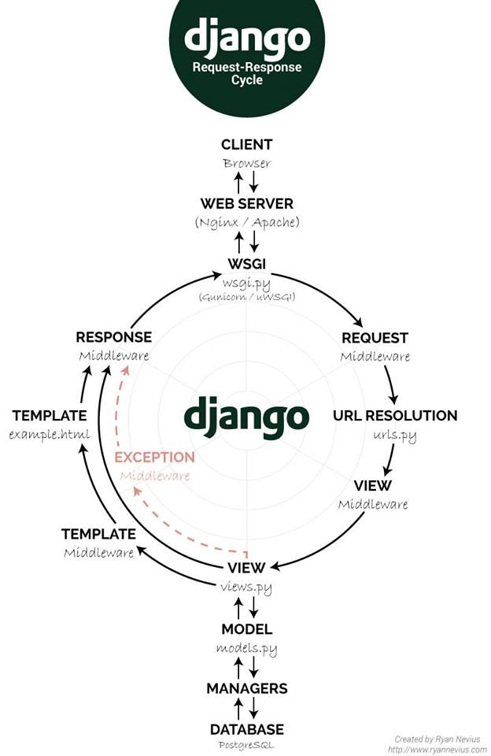

# Django

<TagLinks />



## Features?

> build a website with database attached to it

- high level web framework with **batteries included** started in 2003
- [instagram](https://instagram-engineering.com/web-service-efficiency-at-instagram-with-python-4976d078e366), pinterest, dropbox
- creating Django Data Models and then rendering them into Views. Full MVC pattern compliant
- Free admin UI out of the box
- [single request/response model like PHP at a time, single threaded](https://www.reddit.com/r/django/comments/99lu1k/how_do_you_make_django_handle_multiple_requests/)
- Security against SQL injection, cross-site scripting, cross-site request forgery and clickjacking.
- WSGI successor (PEP 333 & PEP 3333) => [ASGI Asynchronous Server Gateway Interface](https://asgi.readthedocs.io/en/latest/specs/index.html)
  - Django Channels, Queue implementation
  - CGI, run C code from HTTP requests
  - before request/response now we are talking about **connection and events**
- Can create and mount multiple apps under various urls paths, use `include()`

```
# startup commands
python -m venv venv && source ./venv/bin/activate
pip install django && django-admin startproject dj2021 && cd dj2021
# create local sqlite DB, run it anytime after to make new, change django models
python manage.py migrate
python manage.py runserver
```


::: tip django migrations
You have 18 unapplied migration(s). Your project may not work properly until you apply the migrations for app(s): admin, auth, contenttypes, sessions.
Run 'python manage.py migrate' to apply them.

Migrations are Django’s way of propagating changes you make to your models (adding a field, deleting a model, etc.) into your database schema.

start development server`python manage.py migrate && python manage.py runserver`

Django tracks which ones are applied using a special table in your database called **django_migrations**) and runs them against your database - essentially, synchronizing the changes you made to your models with the schema in the database.
:::

## New App

Django apps are more like components

```
python manage.py startapp <app_name>
python manage.py createsuperuser
```

- Let django know about your new app model, wire up new app into django

### How to write views?

- How to add App namespace?
- Pass Template Context Variables to views
- view templates can inherit other templates
- Template Tags `block` and `extends`, if, for loop, filters stacking is possible
- Cross reference and linking?
- Namespace your local app URLs
- class based views
- How to Paginate data from models to views? `from django.core.paginator import paginator`
  - page number from query string `paginator.page(request.GET.get('page', 1))`

### How to add new models?

::: tip changing Models
Anytime you change models, dont forget to run makemigrations and migrate
:::

Add values to database directly from shell

```
python manage.py makemigrations polls
python manage.py migrate
python manage.py shell
python manage.py sqlmigrate polls 0001

```

- Register your app models to admin `admin.site.register(Question)`
- How to raise 404 ? when model doesnt exist? `get_object_or_404`

[what is refential CASCADE in django models?](https://stackoverflow.com/questions/38388423/what-does-on-delete-do-on-django-models)

: When the referenced object is deleted, also delete the objects that have references to it (when you remove a blog post for instance, you might want to delete comments as well). SQL equivalent: CASCADE.

- Pull data from Models in Template Context?
- QuerySet `object.all()`

## Deal with Forms? Capturing data

```
from django import forms
```

- diff b/w ModelForms and Form? Validations provide by django
- `action` and `method`, create your own google search form
- Add security while using POST ``
  - user can clear up `required` from HTML form at client side and try to submit
  - `my_form.is_valid`, `my_form.clean_data`
- Initial data on form, default data

## How is it different?

Ruby of rails

- twitter, shopify 14 years ago

### Django | node.js | ruby on rails

#### production web-server | database

#### postgresSQL vs mySQL

## How to work with django?

- [Write django queries](https://docs.djangoproject.com/en/3.2/topics/db/queries/)
- [ ] Create new App
- [ ] Add apps to your django project
- [ ] Create new models
- [ ] Run migrations
- [ ] Add model to admin
- [ ] Create new views and send Template Context Variables to them
- [ ] Forms and add Security

## Django Projects

- https://github.com/techwithtim/Music-Controller-Web-App-Tutorial

## Quesstions

- Django backend and react frontend
- Backend for Mobile endpoints
- [hosting?](https://www.pythonanywhere.com/)

<Footer />
