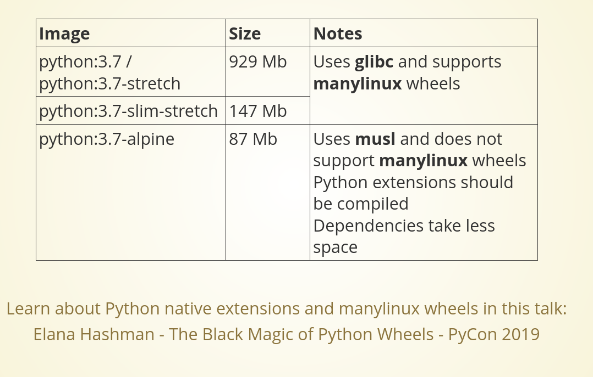

# Deploy Python App

<TagLinks />

## Optimization Matrix

1. [ ] Image Size?
2. [ ] Initial and subsequent build times?

### Popular base images for python



### Which one to choose?


### Whast is the difference between various images?

- alpine is only **90 MB**, `python-slim-stretch` is 2X that of `alpine`
- `python` base image is almost 1GB, **10X** more than alpine
- Debian image has lot of built-in python native C Expensions, like cryptography lubraries.
  - Debian Images have **more Linux Wheels**

::: tip Remove docker layer
If you want to delete docker Layer, remove them in the same step. Else they have no effect on image size
System level deps -> Python level deps -> App level deps
:::

## Google Cloud Run

- Provision stateful services (like Bucket access, and DB access) to stateless app container.
- Link stateful and stateless services

```
gcloud run deploy agate-dotcom \
  --platform managed \
  --add-cloudsql-instance vivid:us-central1:agate \
  ...

```

How to link static assets? setup `django collectstatic`

```
pip install django-storages[google]

DEFAULT_FILE_STORAGE = ()
```

How do I run django commands? Containers do NOT provide me a shell to run `migrate` commands

- Add steps between build and deploy in `cloudbuild.yaml`

## Challenges

- Semantic Web 3.0, graphQL-LD
- [Match making algorithm](https://www.teachyourselfpython.com/challenges.php?a=04_Mini_Projects_NEA_Samples_Tutorials&t=00_Mini_Project_Dating_Program&s=05_Matchmake_and_Validation)

## Resources

- https://slides.com/dmfigol/optimizing-docker-builds-for-python-applications
- Black Magic of Python Wheels

<iframe width="560" height="315" src="https://www.youtube.com/embed/02aAZ8u3wEQ" title="YouTube video player" frameborder="0" allow="accelerometer; autoplay; clipboard-write; encrypted-media; gyroscope; picture-in-picture" allowfullscreen></iframe>

<Footer />
