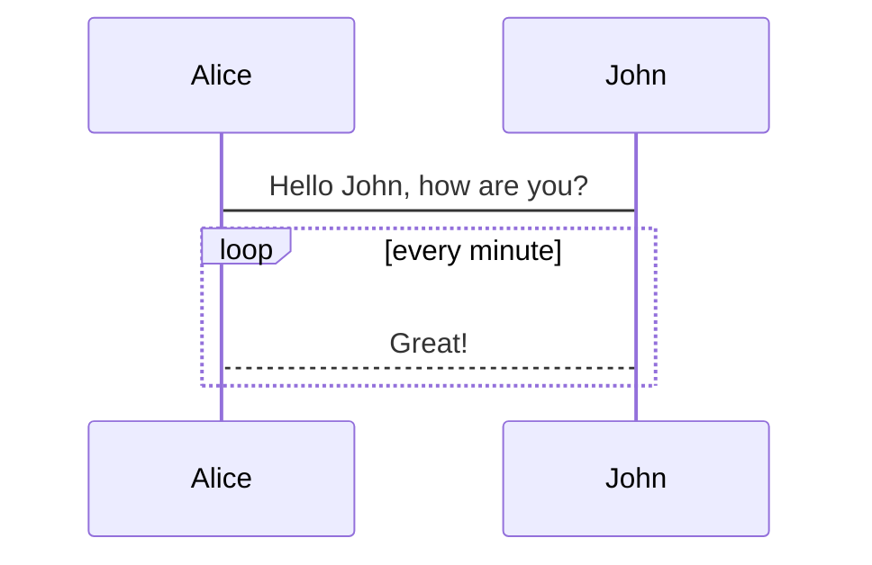
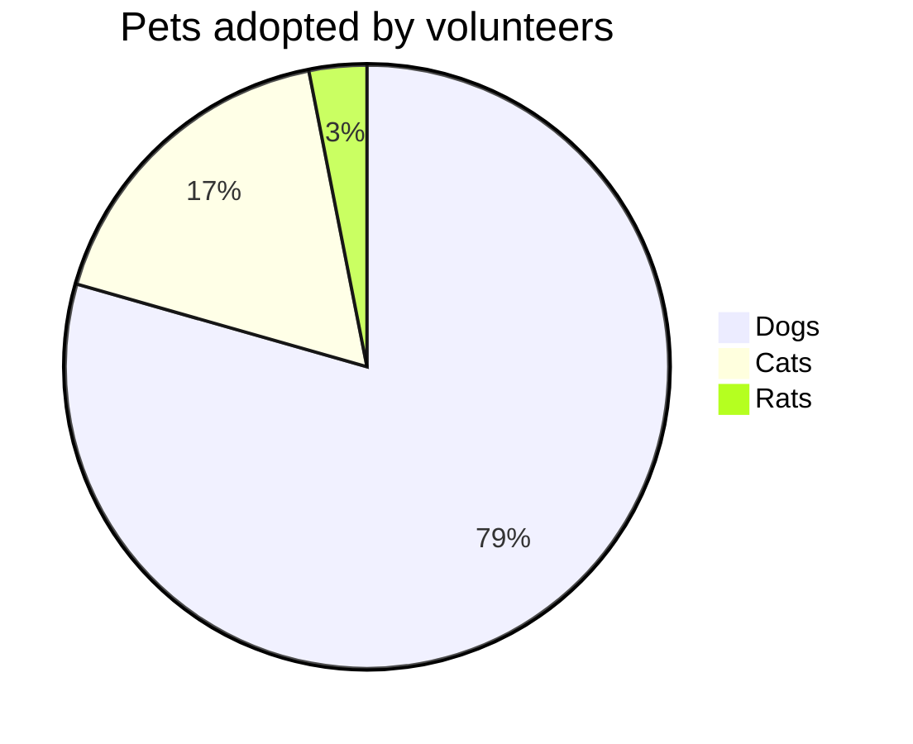
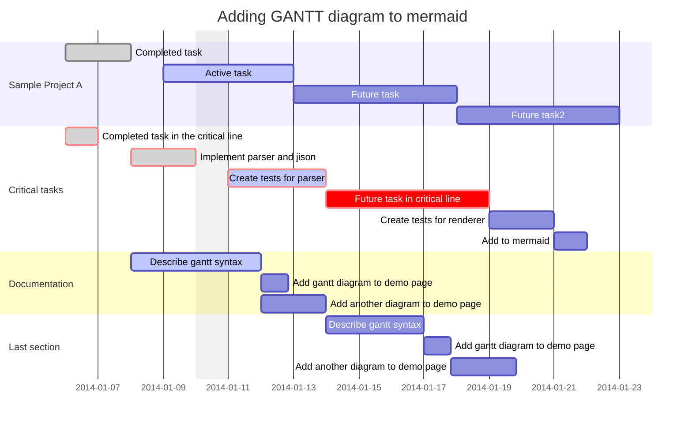

# 1. Test Page

<Badge type="tip" vertical="top" text="beta+"  />
<Badge type="warning" vertical="top" text="beta+"  />
<Badge type="error" vertical="top" text="beta+"  />

## 1.1. Mermaid

### 1.1.1. Sequence Diagram



### 1.1.2. Pie Chart



### 1.1.3. Git graph


### 1.1.4. Gantt Chart

[Basics of Gantt Chart](https://avimehenwal.in/blog/gantt-chart/)



## 1.2. Inserting code snipped from a python file

<<< @/../src/hidden_features.py#snippet{5}

### 1.2.1. sub

H~2~0 H~2~

### 1.2.2. Sup

29^th^   s^e^c~o~n^d^

## 1.3. Footnote

Here is a footnote reference,[^1] and another.[^longnote]

[^1]: Here is the footnote.

[^longnote]: Here's one with multiple blocks.

## 1.4. Definition List

Term 1

:   Definition 1

Term 2 with *inline markup*

:   Definition 2

        { some code, part of Definition 2 }

    Third paragraph of definition 2.

## 1.5. Abbr

*[HTML]: Hyper Text Markup Language
*[W3C]:  World Wide Web Consortium
The HTML specification
is maintained by the W3C.

## 1.6. Emoji

:smile: :tada: :100:


## 1.7. Container

::: warning
*here be dragons*
:::

## 1.8. markdown-it-ins

++inserted++

## 1.9. markdown-it-mark

==marked==


### 1.9.1. Add all markdown packages

```
yarn add -D markdown-it-container markdown-it-footnote markdown-it-deflist markdown-it-emoji markdown-it-mark markdown-it-abbr markdown-it-sub markdown-it-sup markdown-it-ins
```
